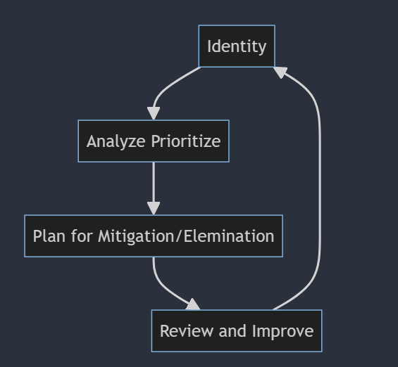

## Investment Banking

* An investment bank is a financial services company that acts as an intermediary in large and complex financial transactions. 
* An investment bank is usually involved in launch of an initial public offering (IPO) and Merger. 
* It also has a role as a broker or financial adviser for large institutional clients such as pension funds.
* It not provide services to General Public

#### Core Bussiness of Investment Banks
* Merchant Banking Services
* Capital Creation
* International Financial
* Management of public offer of debt or equity for corporates
* Advisory and Transaction Services
* Merger and Acquitisions
* Capital restructuring
* Loan term financing
* Managing complex financial deals
* Underwiting
* Risk taking
* Ensuring success of public issue of debt or equity of a firm
* Market Making 
* Investment in primary market
* Bought Out Deals

#### Support Activity
* Secondary Market Services
* Support Services
* Venture Capital
* Private Equity
* Asset Management


## Investment Product
Investment product are those assets or items that an individual buys not for present consumption but for use in future to create wealth.

#### Rate of Intereset (ROI)
Interest is to earn profit of actual investment.

#### Risk
It associated with loss of investment and returns

#### Liquidity
It means the ease with which the investment product can be converted to case or cash equivalent

#### Currency
Currency determine acceptability of investment.
Determine sensitivity of the product to currency fluctuations.

#### Face Value
It is the amount of money a particular investment is worth, It is the amount in principal when investment is mature

#### Issuer
It is an product introuce by organisation/individual to create a investment product

#### Gurantee
It legal agreement to protect the buyer if he sufferes losses due to the purchase of a particular investment product.

#### Returns
Gains in return from an invesmtnt, It can be done by 2 different way
* Change in the value of the investment product over the period it was held by the investor
* Market value of an invested asset appreciates over time.

### Types of Investment Product
* Equity 
* Debt
* Assets (Gold, RealEstate, ForeignExchange, etc)
* Derivatives


### Gross Domestic Product (GDP)

GDP is the market value of all finshed goods and services produced within a country in the current year. It only count production if it happen in current year.

#### Ways to calculate GDP

* #### Income Approach
Calculate income earned by all factors of production 
```
National Income = Wages + Rent + Interest + Profits + Depreciation + NetForeignFactoIncome (NFFI)

GDP (FactorCost) = NetNationalIncome + Depreciation + NFFI

#In India GDP (MarketCost) is used to calculate GDP
GDP (MarketCost) = GDP (FactorCost) + IndirectTaxes - Subsidies
```

* #### Expenditure Approach
Sum of money spent on goods and services
```
GDP = Consumption + Investment + Govt.Expenditure + (Export-Import)
```

#### Drawback of GDP number
* Calculation dosen't include undergroung (black money) economy
* Non Market production not measured
* Calculation complexities
* Changes in quality


### Risk Management Process

* #### Whats your Goal



```python

```
